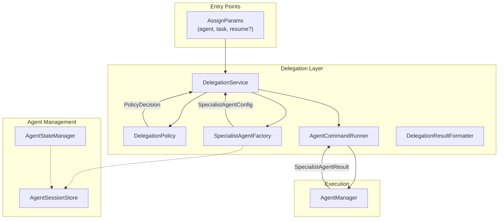
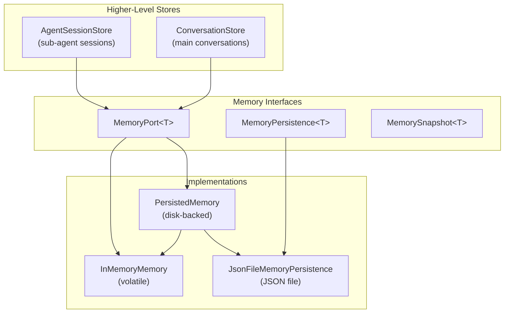
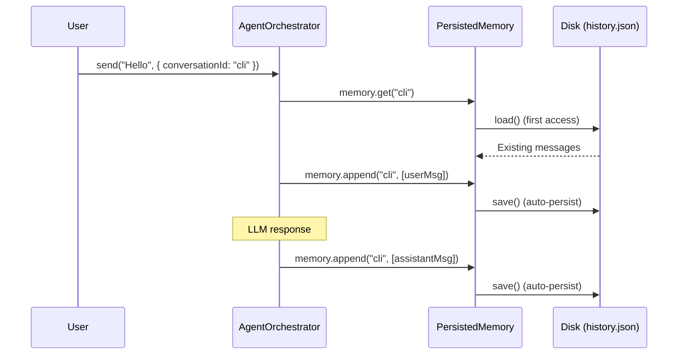
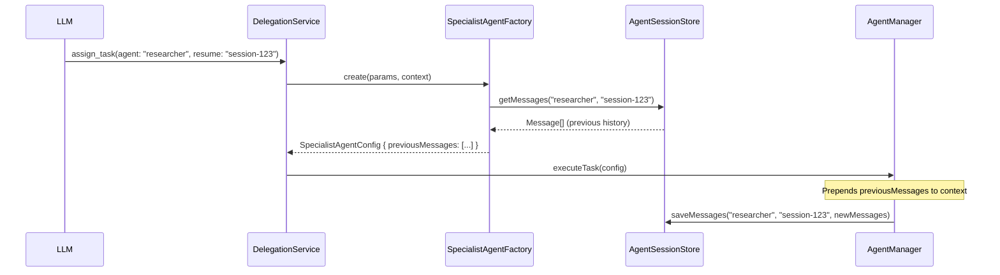

# Sub-Agent & Memory Persistence Architecture

This document describes the delegation system, memory persistence layer, and the relationship between session IDs and conversation IDs in the nuvin agent system.

## Overview

The system consists of two main components:
1. **Delegation Layer** - Manages sub-agent creation and execution
2. **Memory Persistence Layer** - Stores conversation history and session data

---

## Delegation Architecture



### Key Components

| Component | File | Responsibility |
|-----------|------|----------------|
| **DelegationService** | `DefaultDelegationService.ts` | Main orchestrator; supports sync and async delegation |
| **DelegationPolicy** | `DefaultDelegationPolicy.ts` | Evaluates if agent is allowed (checks `enabledAgents`) |
| **SpecialistAgentFactory** | `DefaultSpecialistAgentFactory.ts` | Creates config from template + params; handles session resumption |
| **AgentCommandRunner** | `AgentManagerCommandRunner.ts` | Wraps `AgentManager.executeTask()` |
| **AgentStateManager** | `AgentStateManager.ts` | Tracks session lifecycle (pending → running → completed/failed) |
| **AgentSessionStore** | `AgentSessionStore.ts` | Persists session messages using `MemoryPort` |

---

## Memory Persistence Architecture



### MemoryPort Interface

```typescript
interface MemoryPort<T> {
  get(key: string): Promise<T[]>;
  set(key: string, items: T[]): Promise<void>;
  append(key: string, items: T[]): Promise<void>;
  delete(key: string): Promise<void>;
  keys(): Promise<string[]>;
  clear(): Promise<void>;
  exportSnapshot(): Promise<MemorySnapshot<T>>;
  importSnapshot(snapshot: MemorySnapshot<T>): Promise<void>;
}
```

### Implementations

| Class | Persistence | Use Case |
|-------|-------------|----------|
| `InMemoryMemory` | Volatile (RAM) | Tests, temporary sessions |
| `PersistedMemory` | Disk-backed | Production, resumable sessions |
| `JsonFileMemoryPersistence` | JSON file I/O | File-based storage adapter |

---

## Session ID vs Conversation ID

### Session ID

- **Scope**: Application-level / CLI session
- **Purpose**: Identifies a **persistent file-system session**
- **Format**: Timestamp-based (e.g., `"1735804866000"`)
- **Storage Path**: `~/.nuvin-cli/profiles/{profile}/sessions/{sessionId}/`

```typescript
// Generated in OrchestratorManager.ts
private resolveSession(config: { sessionId?: string }): { sessionId: string; sessionDir: string } {
  const sessionId = config.sessionId ?? String(Date.now());
  const sessionDir = path.join(sessionsDir, sessionId);
  return { sessionId, sessionDir };
}
```

### Conversation ID

- **Scope**: Logical conversation within a session
- **Purpose**: Key for storing/retrieving messages in memory
- **Format**: Typically `"cli"` or `"default"`
- **Storage**: Key within `MemoryPort<Message>`

```typescript
// Used in orchestrator.ts
const convo = opts.conversationId ?? 'default';
const history = await this.memory.get(convo);
await this.memory.append(convo, [userMsg, assistantMsg]);
```

### For Sub-Agents

| Identifier | Example | Purpose |
|------------|---------|---------|
| `sessionId` | `"1735804866000"` | CLI session (disk storage) |
| `conversationId` | `"cli"` | Main conversation key |
| `agentId` | `"researcher-1735804866000-abc123"` | Sub-agent session ID |

**Sub-agent storage key**: `agent:{agentType}:{agentId}`

---

## Main CLI Agent Memory Flow

### 1. Memory Creation

```typescript
// OrchestratorManager.ts
private createMemory(sessionDir: string, memPersist: boolean): MemoryPort<Message> {
  return memPersist
    ? new PersistedMemory<Message>(new JsonFileMemoryPersistence(path.join(sessionDir, 'history.json')))
    : new InMemoryMemory<Message>();
}
```

### 2. Storage Flow



### 3. File Structure

```
~/.nuvin-cli/profiles/default/sessions/1735804866000/
├── history.json      # Message persistence
├── events.json       # Event log (if enabled)
└── http-log.json     # HTTP logs (if enabled)
```

### 4. JSON Format

```json
{
  "cli": [
    { "id": "uuid-1", "role": "user", "content": "Hello", "timestamp": "..." },
    { "id": "uuid-2", "role": "assistant", "content": "Hi!", "timestamp": "...", "usage": {...} },
    { "id": "call-1", "role": "tool", "content": "...", "tool_call_id": "call-1", "name": "file_read" }
  ],
  "__metadata__:cli": [
    { "topic": "Greeting", "createdAt": "...", "messageCount": 3, "totalTokens": 150 }
  ]
}
```

---

## Sub-Agent Session Storage

### Storage Key Format

```
agent:{agentType}:{sessionId}
```

Example: `agent:researcher:researcher-1735804866000-abc123`

### Session Resumption Flow



---

## Key Design Decisions

1. **Unified Port Interface** - Both conversations and sub-agents use `MemoryPort`
2. **Distinct Key Namespaces** - Sub-agents use `agent:` prefix, main conversations use raw IDs
3. **Lazy + Eager Persistence** - `PersistedMemory` loads lazily but saves eagerly
4. **Metadata Stored Separately** - `__metadata__:*` keys store structured metadata
5. **Session Resumption** - Sub-agents can resume via `resume` parameter in `assign_task`
