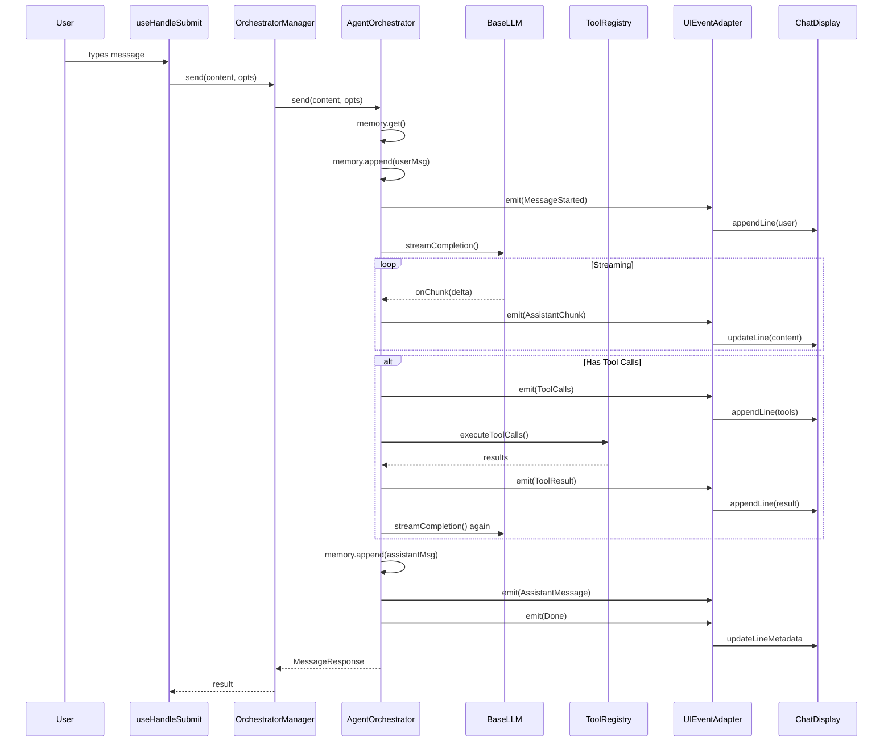

# Message Flow Analysis: User Input → Response

This document describes the complete logical flow from when a user inputs a message in the CLI until they receive a response. It focuses on function calls and the interaction between the **nuvin-cli** and **nuvin-core** packages.

## Overview Diagram

```
┌─────────────────────────────────────────────────────────────────────────────┐
│                              CLI PACKAGE                                     │
├─────────────────────────────────────────────────────────────────────────────┤
│                                                                              │
│  1. User Input                                                               │
│     └─> useHandleSubmit()                                                   │
│         └─> executeCommand() or processMessage()                            │
│                                                                              │
│  2. Processing Message                                                       │
│     └─> OrchestratorManager.send()                                          │
│         ├─> initializePersistedSession() [lazy, first message only]         │
│         ├─> createLLM()                                                     │
│         └─> AgentOrchestrator.send()  ─────────────────────────────────────┼─┐
│                                                                              │ │
│  3. Event Handling (Response Display)                                        │ │
│     └─> UIEventAdapter.emit()                                               │ │
│         └─> processAgentEvent()                                             │ │
│             └─> callbacks.appendLine() / updateLine()                       │ │
│                                                                              │ │
└──────────────────────────────────────────────────────────────────────────────┘ │
                                                                                 │
┌────────────────────────────────────────────────────────────────────────────────┘
│
│  ┌─────────────────────────────────────────────────────────────────────────────┐
│  │                              CORE PACKAGE                                    │
│  ├─────────────────────────────────────────────────────────────────────────────┤
│  │                                                                              │
▼  │  4. AgentOrchestrator.send()                                                 │
   │     ├─> memory.get() [get conversation history]                             │
   │     ├─> context.toProviderMessages() [build messages]                       │
   │     ├─> memory.append() [store user message]                                │
   │     ├─> events.emit(MessageStarted)                                         │
   │     ├─> tools.getToolDefinitions()                                          │
   │     │                                                                        │
   │     │  ┌─ STREAMING MODE ─┐     ┌─ NON-STREAMING ─┐                         │
   │     ├─>│ LLM.streamCompletion()│ or │ LLM.generateCompletion()│              │
   │     │  │                       │     │                        │              │
   │     │  │ Callbacks:            │     │                        │              │
   │     │  │ ├─ onChunk()          │     │                        │              │
   │     │  │ ├─ onReasoningChunk() │     │                        │              │
   │     │  │ ├─ onStreamFinish()   │     │                        │              │
   │     │  │ └─ onUsage()          │     │                        │              │
   │     │  └───────────────────────┘     └────────────────────────┘              │
   │     │                                                                        │
   │     │  [Tool Execution Loop - if tool_calls present]                        │
   │     ├─> events.emit(ToolCalls)                                              │
   │     ├─> processToolApproval()                                               │
   │     │   ├─> shouldBypassApproval() [check read-only tools]                  │
   │     │   ├─> waitForToolApproval() [if approval required]                    │
   │     │   │   └─> events.emit(ToolApprovalRequired)                           │
   │     │   └─> handleToolDenial() [if denied]                                  │
   │     │                                                                        │
   │     ├─> convertToolCallsWithErrorHandling()                                 │
   │     ├─> tools.executeToolCalls()                                            │
   │     │   └─> [each tool executes, e.g., BashTool.invoke()]                   │
   │     ├─> events.emit(ToolResult) [for each result]                           │
   │     ├─> memory.append() [store assistant + tool messages]                   │
   │     │                                                                        │
   │     │  [Continue loop if more tool_calls, call LLM again]                   │
   │     │                                                                        │
   │     ├─> memory.append() [store final assistant message]                     │
   │     ├─> events.emit(AssistantMessage) [final response]                      │
   │     ├─> metrics.recordRequestComplete()                                     │
   │     └─> events.emit(Done)                                                   │
   │                                                                              │
   │     return MessageResponse                                                   │
   │                                                                              │
   └──────────────────────────────────────────────────────────────────────────────┘
```

---

## Detailed Function Call Chain

### Phase 1: User Input Capture (CLI)

| Step | Function | Location |
|------|----------|----------|
| 1.1 | User types message in terminal | Input Component |
| 1.2 | `useHandleSubmit()` | `source/hooks/useHandleSubmit.ts` |
| 1.3 | `prepareUserSubmission()` | `source/utils/userSubmission.ts` |
| 1.4 | `processMessage()` | App callback |

**Description:**
- User types a message and presses Enter
- `useHandleSubmit()` hook handles the submission
- If input starts with `/`, it's treated as a command via `executeCommand()`
- Otherwise, `prepareUserSubmission()` processes attachments and creates a `UserMessagePayload`
- Finally, `processMessage()` is called to send to the orchestrator

### Phase 2: Message Processing (CLI → Core)

| Step | Function | Location |
|------|----------|----------|
| 2.1 | `orchestratorManager.send()` | `source/services/OrchestratorManager.ts:901` |
| 2.2 | `initializePersistedSession()` | `source/services/OrchestratorManager.ts:605` (lazy) |
| 2.3 | `createLLM()` | `source/services/OrchestratorManager.ts:683` |
| 2.4 | `orchestrator.send()` | `nuvin-core/src/orchestrator.ts:469` |

**Description:**
- `OrchestratorManager.send()` is the main entry point from CLI to core
- On first message (if `memPersist` is true), `initializePersistedSession()` creates session directory and switches from in-memory to file-backed storage
- A fresh LLM instance is created with current config
- Delegates to `AgentOrchestrator.send()` in core package

### Phase 3: Core Orchestration (Core)

| Step | Function | Location |
|------|----------|----------|
| 3.1 | `memory.get()` | `MemoryPort` implementation |
| 3.2 | `context.toProviderMessages()` | `SimpleContextBuilder` |
| 3.3 | `memory.append()` | Store user message |
| 3.4 | `events.emit(MessageStarted)` | `EventPort` |
| 3.5 | `tools.getToolDefinitions()` | `src/tools.ts:89` |

**Description:**
- Retrieves conversation history from memory
- Converts internal messages to LLM provider format
- Stores the user message immediately
- Emits `MessageStarted` event for UI to show user message
- Gets available tool definitions for the LLM

### Phase 4: LLM Completion (Core)

| Step | Function | Location |
|------|----------|----------|
| 4.1 | `llm.streamCompletion()` or `llm.generateCompletion()` | `src/llm-providers/base-llm.ts:282` / `src/llm-providers/base-llm.ts:251` |
| 4.2 | `transport.request()` | `HttpTransport` implementation |
| 4.3 | *streaming callbacks*: `onChunk()`, `onReasoningChunk()`, `onStreamFinish()` | Inline in `orchestrator.send()` |
| 4.4 | `events.emit(AssistantChunk)` | Per chunk (streaming mode) |

**Description:**
- Calls the LLM provider API (OpenRouter, Anthropic, GitHub, etc.)
- In streaming mode, chunks are emitted via callbacks as they arrive
- Each chunk triggers `events.emit(AssistantChunk)` for real-time UI updates
- Usage statistics are tracked via `onUsage()` callback

### Phase 5: Tool Execution Loop (Core - if tool_calls present)

| Step | Function | Location |
|------|----------|----------|
| 5.1 | `events.emit(ToolCalls)` | `src/orchestrator.ts:666` |
| 5.2 | `processToolApproval()` | `src/orchestrator.ts:368` |
| 5.3 | `shouldBypassApproval()` | `src/orchestrator.ts:252` |
| 5.4 | `waitForToolApproval()` | `src/orchestrator.ts:940` (if needed) |
| 5.5 | `events.emit(ToolApprovalRequired)` | (if approval needed) |
| 5.6 | `handleToolApproval()` | `src/orchestrator.ts:960` (response from UI) |
| 5.7 | `convertToolCallsWithErrorHandling()` | `src/tools/tool-call-converter.ts` |
| 5.8 | `tools.executeToolCalls()` | `src/tools.ts:170` |
| 5.9 | `[Tool].invoke()` | Individual tool (e.g., `BashTool`, `FileReadTool`) |
| 5.10 | `events.emit(ToolResult)` | Per tool result |
| 5.11 | `memory.append()` | Store assistant + tool messages |
| 5.12 | *Loop back to 4.1* | If more tool calls needed |

**Description:**
- When LLM returns `tool_calls`, the tool execution loop begins
- Read-only tools (`file_read`, `ls_tool`, `web_search`, etc.) bypass approval
- Other tools may require user approval via `waitForToolApproval()`
- Tool calls are validated and converted to `ToolInvocation` objects
- Tools execute concurrently (up to `maxToolConcurrency`)
- Results are stored in memory and the LLM is called again
- Loop continues until no more tool calls

**Auto-approved (bypass) tools:**
- `file_read`
- `ls_tool`
- `glob_tool`
- `grep_tool`
- `web_search`
- `web_fetch`
- `todo_write`
- `todo_read`

### Phase 6: Finalization (Core)

| Step | Function | Location |
|------|----------|----------|
| 6.1 | `memory.append()` | Store final assistant message |
| 6.2 | `events.emit(AssistantMessage)` | Final content |
| 6.3 | `metrics.recordRequestComplete()` | Record timing |
| 6.4 | `events.emit(Done)` | Completion signal |
| 6.5 | `return MessageResponse` | Back to CLI |

**Description:**
- When LLM returns content without tool calls, the response is finalized
- Final assistant message is stored in memory
- `AssistantMessage` event signals UI to finalize rendering
- Metrics (response time, tokens, cost) are recorded
- `Done` event signals completion
- `MessageResponse` is returned to CLI

### Phase 7: Event Processing → UI Render (CLI)

| Step | Function | Location |
|------|----------|----------|
| 7.1 | `UIEventAdapter.emit()` | `source/adapters/ui-event-adapter.tsx:75` |
| 7.2 | `processAgentEvent()` | `source/utils/eventProcessor.ts:63` |
| 7.3 | `callbacks.appendLine()` | Add line to UI |
| 7.4 | `callbacks.updateLine()` | Update streaming content |
| 7.5 | `callbacks.updateLineMetadata()` | Update metadata (tokens, cost) |

**Description:**
- All events from core pass through `UIEventAdapter`
- `processAgentEvent()` maps events to UI actions
- `appendLine()` adds new message lines to the chat
- `updateLine()` updates content during streaming
- `updateLineMetadata()` adds token counts, cost, timing info

---

## Key Event Types

The orchestrator emits the following event types in order:

```
MessageStarted → AssistantChunk* → [ToolCalls → ToolResult*]* → AssistantMessage → Done
                 │                 │                            │
                 └─ streaming      └─ tool loop                 └─ final response
```

| Event Type | Description |
|------------|-------------|
| `MessageStarted` | User message received, processing begins |
| `AssistantChunk` | Streaming text delta from LLM |
| `ReasoningChunk` | Reasoning/thinking content delta (for reasoning models) |
| `StreamFinish` | Streaming completed for current LLM call |
| `ToolCalls` | LLM requested tool execution |
| `ToolApprovalRequired` | Waiting for user approval |
| `ToolResult` | Tool execution completed |
| `AssistantMessage` | Final assistant response content |
| `Done` | Request fully completed |

---

## Component Summary

| Component | Entry Function | Returns To |
|-----------|---------------|------------|
| **Input** | `useHandleSubmit()` | `processMessage()` |
| **CLI Manager** | `OrchestratorManager.send()` | `App` component |
| **Orchestrator** | `AgentOrchestrator.send()` | `OrchestratorManager` |
| **LLM** | `BaseLLM.streamCompletion()` | `AgentOrchestrator` |
| **Tools** | `ToolRegistry.executeToolCalls()` | `AgentOrchestrator` |
| **Events** | `UIEventAdapter.emit()` | UI callbacks |

---

## Key Files Reference

### CLI Package (`packages/nuvin-cli/source/`)

| File | Purpose |
|------|---------|
| `hooks/useHandleSubmit.ts` | Handles user input submission |
| `hooks/useOrchestrator.ts` | Hook for orchestrator access |
| `services/OrchestratorManager.ts` | Singleton managing orchestrator lifecycle |
| `services/LLMFactory.ts` | Creates LLM provider instances |
| `adapters/ui-event-adapter.tsx` | Bridges core events to UI |
| `utils/eventProcessor.ts` | Processes events into UI updates |

### Core Package (`packages/nuvin-core/src/`)

| File | Purpose |
|------|---------|
| `orchestrator.ts` | Main agent orchestration logic |
| `ports.ts` | Port interfaces (LLM, Memory, Tools, Events) |
| `tools.ts` | Tool registry and execution |
| `llm-providers/base-llm.ts` | Base LLM implementation |
| `context.ts` | Message context building |
| `persistent/` | Memory persistence implementations |

---

## Sequence Diagram



---

## See Also

- [Error Flow Analysis](./error-flow-analysis.md)
- [AssignTool Analysis](./assign_tool-analysis.md)
- [Incremental Memory Persistence](./incremental-memory-persistence.md)
