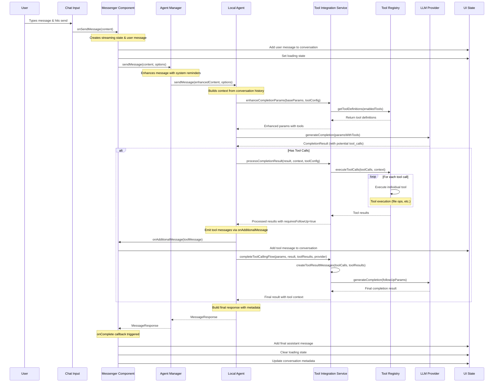

# Message Flow Diagram - Nuvin UI Agent System

## Overview

This diagram shows the complete flow when a user sends a message through the Nuvin UI system, including agent processing, tool calls, and UI updates.

## Key Components & Responsibilities

### 1. **Chat Input Component**

- Captures user input
- Triggers message send via `onSendMessage` callback
- Handles UI state (disabled during processing)

### 2. **Messenger Component**

- Orchestrates the entire message flow
- Manages conversation state and UI updates
- Handles streaming via callbacks:
  - `onChunk`: Updates streaming content in real-time
  - `onAdditionalMessage`: Handles tool execution messages
  - `onComplete`: Finalizes the message and updates UI

### 3. **Agent Manager**

- Central coordinator for agent operations
- Enhances messages with system reminders
- Manages conversation history
- Routes to appropriate agent type (Local/Remote)

### 4. **Local Agent**

- Handles LLM provider interactions
- Manages tool integration workflow
- Processes streaming responses
- Coordinates tool execution flow

### 5. **Tool Integration Service**

- Enhances completion parameters with available tools
- Processes tool calls from LLM responses
- Manages tool execution workflow
- Creates follow-up messages with tool results

### 6. **Tool Registry**

- Maintains registry of available tools
- Executes tool calls with proper context
- Handles concurrent tool execution
- Returns standardized tool results

## Message Flow Types

### Standard Message (No Tools)

1. User input → Agent Manager → Local Agent → LLM Provider
2. Response flows back through same chain
3. UI updated via `onComplete` callback

### Tool-Enhanced Message

1. **Initial Request**: Same as standard flow but with tool definitions
2. **Tool Detection**: LLM returns response with `tool_calls`
3. **Tool Execution**: Tools executed via Tool Registry
4. **Tool Messages**: Emitted via `onAdditionalMessage` callback
5. **Follow-up Request**: New LLM call with tool results
6. **Final Response**: Complete response via `onComplete`

### Streaming Message

- Same flow but with real-time updates via `onChunk` callback
- UI updates progressively as content streams in
- Final message committed via `onComplete`

## Callback System

The system uses three main callbacks for UI coordination:

- **`onChunk(chunk: string)`**: Real-time streaming updates
- **`onAdditionalMessage(message: MessageResponse)`**: Tool execution messages
- **`onComplete(content: string)`**: Final message completion

This allows the UI to provide immediate feedback for tool execution while maintaining a smooth user experience.
