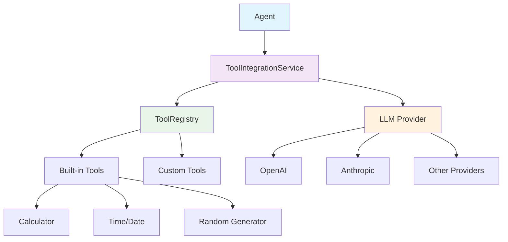
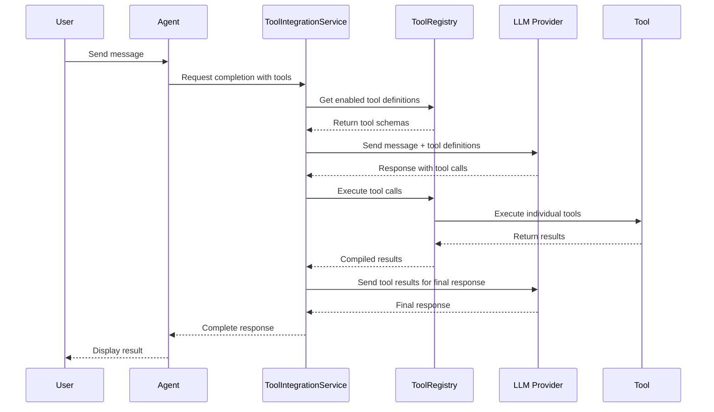
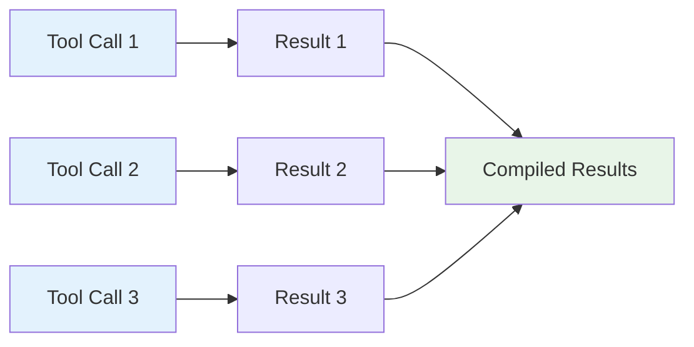

# Function Tools System Documentation

## Overview

The Function Tools System enables LLM models to execute external functions and tools during conversations. This system provides a comprehensive framework for tool registration, management, and execution with full integration into the agent-based chat system.

## Architecture

### Core Components



### Tool Execution Flow



## Component Details

### 1. ToolRegistry

Central registry for managing all available tools.

**Key Features:**
- Tool registration and validation
- Category-based organization
- Concurrent execution management
- Tool discovery and metadata

**API:**
```typescript
class ToolRegistry {
  registerTool(tool: Tool): void
  unregisterTool(toolName: string): boolean
  getTool(toolName: string): Tool | undefined
  getToolDefinitions(enabledTools?: string[]): ToolDefinition[]
  executeTool(toolCall: ToolCall, context?: ToolContext): Promise<ToolCallResult>
  executeToolCalls(toolCalls: ToolCall[], context?: ToolContext, maxConcurrent?: number): Promise<ToolCallResult[]>
}
```

### 2. ToolIntegrationService

Handles the integration between tools and LLM providers.

**Key Features:**
- LLM parameter enhancement with tools
- Tool calling flow orchestration
- Result processing and follow-up handling
- Tool configuration validation

**API:**
```typescript
class ToolIntegrationService {
  enhanceCompletionParams(params: CompletionParams, agentToolConfig?: AgentToolConfig): CompletionParams
  processCompletionResult(result: CompletionResult, context: ToolContext, agentToolConfig?: AgentToolConfig): Promise<ProcessedResult>
  completeToolCallingFlow(originalParams: CompletionParams, firstResult: CompletionResult, toolResults: ToolCallResult[], llmProvider: any, context: ToolContext, agentToolConfig?: AgentToolConfig): Promise<CompletionResult>
  validateToolConfig(agentToolConfig: AgentToolConfig): ValidationResult
}
```

### 3. Tool Interface

Standard interface that all tools must implement.

```typescript
interface Tool {
  definition: ToolDefinition;
  execute: (parameters: Record<string, any>, context?: ToolContext) => Promise<ToolExecutionResult>;
  validate?: (parameters: Record<string, any>) => boolean;
  category?: string;
  version?: string;
  author?: string;
}
```

## Built-in Tools

### Calculator Tool

Performs mathematical calculations with support for basic arithmetic and common functions.

**Usage:**
```json
{
  "name": "calculator",
  "parameters": {
    "expression": "2 + 3 * sin(pi/2)"
  }
}
```

**Supported Operations:**
- Basic arithmetic: `+`, `-`, `*`, `/`, `^`, `%`
- Math functions: `sin`, `cos`, `tan`, `sqrt`, `log`, `exp`, `abs`
- Constants: `pi`, `e`
- Functions: `min`, `max`, `floor`, `ceil`, `round`

### Time Tool

Provides current date and time information with timezone support.

**Usage:**
```json
{
  "name": "get_current_time",
  "parameters": {
    "timezone": "America/New_York",
    "format": "iso"
  }
}
```

**Supported Formats:**
- `iso`: ISO 8601 format
- `readable`: Human-readable format
- `timestamp`: Unix timestamp
- `custom`: Custom format string

### Random Generator Tool

Generates random numbers, strings, UUIDs, and makes random choices.

**Usage:**
```json
{
  "name": "generate_random",
  "parameters": {
    "type": "number",
    "min": 1,
    "max": 100,
    "count": 5
  }
}
```

**Supported Types:**
- `number`: Random integers within range
- `string`: Random strings with configurable charset
- `choice`: Random selection from array
- `uuid`: UUID v4 generation

## Agent Tool Configuration

Agents can control which tools are available and how they're used.

```typescript
interface AgentToolConfig {
  enabledTools: string[];           // Tool names to enable
  toolSettings?: Record<string, any>; // Per-tool configuration
  maxConcurrentCalls?: number;      // Max parallel tool executions
  timeoutMs?: number;               // Tool execution timeout
}
```

**Example Configuration:**
```typescript
const agentToolConfig: AgentToolConfig = {
  enabledTools: ['calculator', 'get_current_time', 'generate_random'],
  maxConcurrentCalls: 3,
  timeoutMs: 30000,
  toolSettings: {
    calculator: { precision: 10 },
    get_current_time: { defaultTimezone: 'UTC' }
  }
};
```

## Usage Examples

### 1. Registering a Custom Tool

```typescript
import { toolRegistry } from '@/lib/tools';

const customTool: Tool = {
  definition: {
    name: 'weather_lookup',
    description: 'Get current weather for a location',
    parameters: {
      type: 'object',
      properties: {
        location: {
          type: 'string',
          description: 'City name or coordinates'
        },
        units: {
          type: 'string',
          enum: ['celsius', 'fahrenheit'],
          description: 'Temperature units'
        }
      },
      required: ['location']
    }
  },

  async execute(parameters) {
    const { location, units = 'celsius' } = parameters;
    // Implementation here
    return {
      success: true,
      data: { temperature: 22, condition: 'sunny' }
    };
  },

  category: 'information',
  version: '1.0.0'
};

toolRegistry.registerTool(customTool);
```

### 2. Agent with Tools

```typescript
import { toolIntegrationService } from '@/lib/tools';

const agentSettings: AgentSettings = {
  id: 'math-assistant',
  name: 'Math Assistant',
  systemPrompt: 'You are a helpful math assistant with access to calculation tools.',
  toolConfig: {
    enabledTools: ['calculator', 'generate_random'],
    maxConcurrentCalls: 2
  }
  // ... other settings
};

// When generating completions
const enhancedParams = toolIntegrationService.enhanceCompletionParams(
  originalParams,
  agentSettings.toolConfig
);
```

### 3. Complete Tool Calling Flow

```typescript
async function handleMessageWithTools(
  message: string,
  agent: AgentSettings,
  llmProvider: LLMProvider
) {
  const context: ToolContext = {
    userId: 'user123',
    sessionId: 'session456'
  };

  // 1. Prepare parameters with tools
  const params = toolIntegrationService.enhanceCompletionParams(
    { messages: [{ role: 'user', content: message }], model: 'gpt-4' },
    agent.toolConfig
  );

  // 2. Get initial response
  const result = await llmProvider.generateCompletion(params);

  // 3. Process tool calls if present
  const processed = await toolIntegrationService.processCompletionResult(
    result,
    context,
    agent.toolConfig
  );

  // 4. Get final response if tools were called
  if (processed.requiresFollowUp && processed.toolCalls) {
    const finalResult = await toolIntegrationService.completeToolCallingFlow(
      params,
      result,
      processed.toolCalls,
      llmProvider,
      context,
      agent.toolConfig
    );
    return finalResult;
  }

  return result;
}
```

## Error Handling

The system provides comprehensive error handling at multiple levels:

### Tool Execution Errors
```typescript
interface ToolExecutionResult {
  success: boolean;
  data?: any;
  error?: string;
  metadata?: Record<string, any>;
}
```

### Validation Errors
- Parameter validation using JSON Schema
- Tool availability checking
- Configuration validation

### Runtime Errors
- Timeout handling
- Concurrent execution limits
- Network/API failures

## Security Considerations

### Input Sanitization
- Mathematical expressions are sanitized for calculator tool
- Parameter validation prevents injection attacks
- Timeout limits prevent infinite execution

### Access Control
- Agents explicitly define which tools they can access
- Tool execution is sandboxed
- No direct system access from tools

### Resource Limits
- Concurrent execution limits
- Timeout constraints
- Memory usage monitoring

## Performance Optimization

### Concurrent Execution


### Caching Strategy
- Tool definition caching
- Result caching for idempotent tools
- Registry state persistence

### Batching
- Multiple tool calls processed in parallel
- Configurable concurrency limits
- Efficient resource utilization

## Extension Points

### Adding New Tools
1. Implement the `Tool` interface
2. Register with `toolRegistry.registerTool(tool)`
3. Add to agent's `enabledTools` array

### Custom Categories
Tools can be organized into custom categories for better management:
```typescript
const tool: Tool = {
  // ... definition
  category: 'data-analysis'
};
```

### Provider Integration
The system is designed to work with any LLM provider that supports function calling:
- OpenAI GPT-4/GPT-3.5
- Anthropic Claude
- Custom providers implementing the interface

## Monitoring and Debugging

### Execution Tracking
```typescript
const context: ToolContext = {
  userId: 'user123',
  sessionId: 'session456',
  metadata: {
    traceId: 'trace789',
    debug: true
  }
};
```

### Performance Metrics
- Tool execution time
- Success/failure rates
- Concurrent usage patterns
- Resource consumption

## Best Practices

1. **Tool Design**
   - Keep tools focused and single-purpose
   - Provide clear descriptions and parameter schemas
   - Include proper validation
   - Handle errors gracefully

2. **Agent Configuration**
   - Only enable necessary tools
   - Set appropriate timeout limits
   - Configure reasonable concurrency limits

3. **Error Handling**
   - Always check tool execution results
   - Provide meaningful error messages
   - Implement fallback strategies

4. **Security**
   - Validate all inputs
   - Limit tool capabilities
   - Monitor tool usage
   - Implement proper access controls

## Future Enhancements

- Tool versioning and compatibility
- Dynamic tool loading
- Tool marketplace/registry
- Advanced caching strategies
- Performance analytics dashboard
- Tool composition and chaining