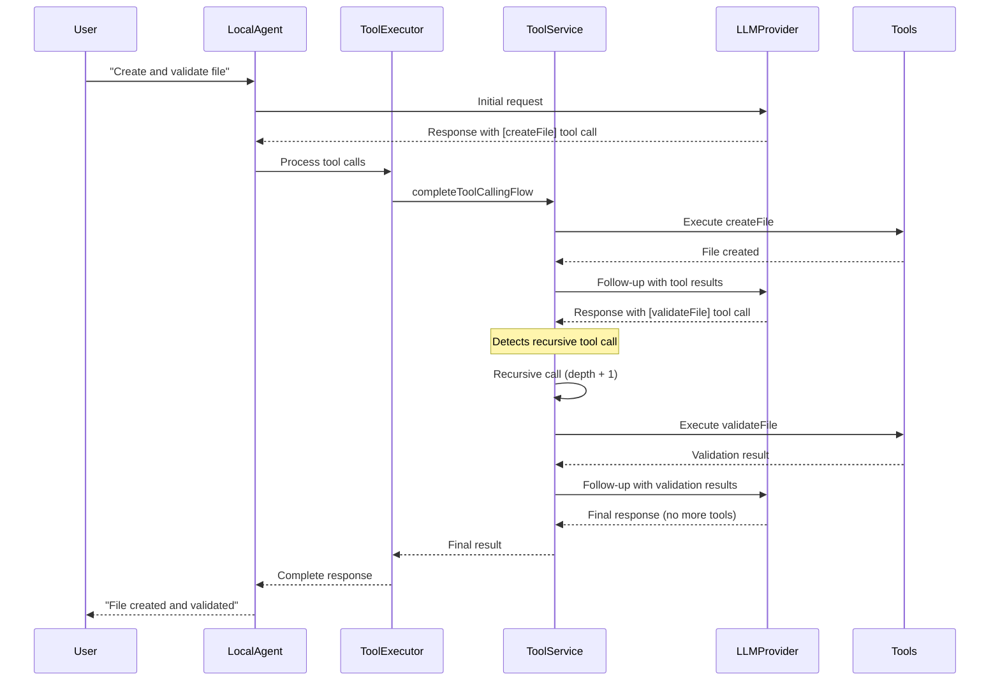

# Recursive Tool Call Handling in Refactored LocalAgent

## Overview

The refactored LocalAgent correctly handles recursive tool calls where the LLM can return additional tool calls in follow-up responses.

## How It Works

### 1. **Initial Tool Call Flow**

```
User: "Create a file and then read it back"
↓
LLM Response 1: [tool_call: createFile]
↓
Tool Execution: Creates file
↓
LLM Response 2: [tool_call: readFile] ← RECURSIVE TOOL CALL
↓
Tool Execution: Reads file
↓
LLM Response 3: "I created the file and here's its content..."
```

### 2. **Implementation Details**

The `completeToolCallingFlow` method in `ToolIntegrationService` handles recursion:

```typescript
async completeToolCallingFlow(
  originalParams: CompletionParams,
  firstResult: CompletionResult,
  toolResults: ToolCallResult[],
  llmProvider: LLMProvider,
  context?: ToolContext,
  agentToolConfig?: AgentToolConfig,
  maxRecursionDepth: number = 50, // Prevent infinite loops
  currentDepth: number = 0,
): Promise<CompletionResult> {
  // ... execute tools ...

  const finalResult = await llmProvider.generateCompletion(followUpParams);

  // Check if the final result contains MORE tool calls
  if (finalResult.tool_calls && finalResult.tool_calls.length > 0) {
    console.log(`Follow-up response contains ${finalResult.tool_calls.length} tool calls, processing recursively (depth: ${currentDepth + 1})`);

    // Process the new tool calls
    const processed = await this.processCompletionResult(
      finalResult,
      context!,
      agentToolConfig,
    );

    if (processed.requiresFollowUp && processed.tool_results) {
      // RECURSIVE CALL with incremented depth
      return await this.completeToolCallingFlow(
        followUpParams,
        finalResult,
        processed.tool_results,
        llmProvider,
        context,
        agentToolConfig,
        maxRecursionDepth,
        currentDepth + 1, // Increment depth
      );
    }
  }

  return finalResult;
}
```

### 3. **Safety Mechanisms**

#### **Recursion Depth Limit**

- Default maximum depth: 50 calls
- Prevents infinite loops
- Graceful degradation when limit reached

#### **Error Handling**

- Each recursive call is wrapped in try-catch
- Failed tool calls don't break the chain
- Partial results are preserved

### 4. **Example Scenarios**

#### **Scenario 1: File Operations Chain**

```
1. User: "Create a config file with default settings and validate it"
2. LLM: [createFile] → Creates config.json
3. LLM: [readFile] → Reads config.json to validate
4. LLM: [validateConfig] → Validates the configuration
5. LLM: "Configuration file created and validated successfully"
```

#### **Scenario 2: Data Processing Pipeline**

```
1. User: "Fetch data from API and process it"
2. LLM: [fetchAPI] → Gets raw data
3. LLM: [processData] → Transforms data
4. LLM: [saveData] → Saves processed data
5. LLM: [generateReport] → Creates summary report
6. LLM: "Data pipeline completed successfully"
```

#### **Scenario 3: Complex Analysis**

```
1. User: "Analyze this codebase for issues"
2. LLM: [listFiles] → Gets file list
3. LLM: [readFile] → Reads each file (multiple calls)
4. LLM: [analyzeCode] → Analyzes patterns
5. LLM: [generateReport] → Creates analysis report
6. LLM: "Analysis complete, found 3 issues..."
```

### 5. **Refactored Implementation Benefits**

#### **Before (Original)**

- Recursive logic mixed with other concerns
- Hard to test recursive scenarios
- Complex error handling

#### **After (Refactored)**

- Clean separation: `ToolExecutor` delegates to `ToolIntegrationService`
- `ToolIntegrationService` handles all recursion logic
- Easy to test each component independently
- Clear error boundaries

### 6. **Message Flow with Recursion**



### 7. **Testing Recursive Tool Calls**

```typescript
describe("Recursive Tool Calls", () => {
  it("should handle multiple tool call rounds", async () => {
    const mockProvider = {
      generateCompletion: jest
        .fn()
        .mockResolvedValueOnce({
          content: "",
          tool_calls: [
            { id: "1", function: { name: "createFile", arguments: "{}" } },
          ],
        })
        .mockResolvedValueOnce({
          content: "",
          tool_calls: [
            { id: "2", function: { name: "readFile", arguments: "{}" } },
          ],
        })
        .mockResolvedValueOnce({
          content: "File created and read successfully",
          tool_calls: [],
        }),
    };

    const result = await localAgent.sendMessage(["Create and read a file"]);

    expect(mockProvider.generateCompletion).toHaveBeenCalledTimes(3);
    expect(result.content).toBe("File created and read successfully");
  });
});
```

## Conclusion

The refactored LocalAgent correctly handles recursive tool calls by:

1. **Delegating** recursion logic to `ToolIntegrationService`
2. **Maintaining** clean separation of concerns
3. **Preserving** all safety mechanisms (depth limits, error handling)
4. **Enabling** complex multi-step tool workflows
5. **Supporting** unlimited tool call chains (within safety limits)

This ensures that complex AI workflows can execute seamlessly while maintaining code maintainability.
